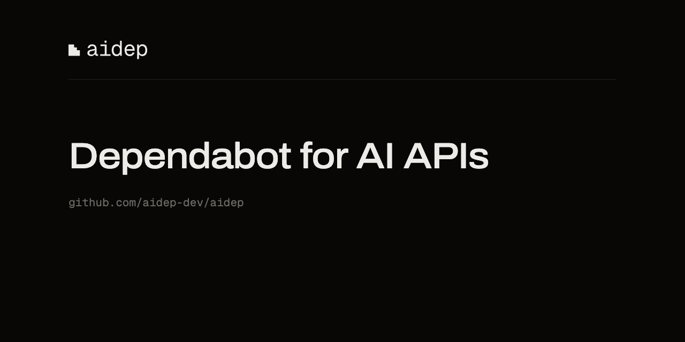

# aidep

Dependabot for AI APIs. aidep knows every OpenAI, Anthropic, and Google model and API deprecation, scans a GitHub repo for exposure, opens the migration PR, and proves the migration held by running the repo's own prompts on the old and new model in the repo's own CI.

Live at [aidep.dev](https://aidep.dev). Install the GitHub App from there, or run `npx aidep .` for a local scan with no account.

Two repos make the product:

- **aidep** (this repo): one Next.js app. GitHub App webhook, scan pipeline, migration PR generation, eval pack generation, dashboard, public pages.
- **[aidep-registry](https://github.com/aidep-dev/aidep-registry)**: the deprecation registry as JSON, plus the parsers and the daily poller that keep it current. Clone it as a sibling directory (`../aidep-registry`), or point `REGISTRY_SOURCE` at a raw URL serving its `registry/` files.

## Run it locally

Prereqs: Node 24+, Docker, npm.

```sh
git clone https://github.com/aidep-dev/aidep.git
git clone https://github.com/aidep-dev/aidep-registry.git
cd aidep
npm ci
docker compose up -d          # Postgres on localhost:5433
node src/db/migrate.ts        # applies db/schema.sql (idempotent)
npm test                      # needs the database
```

Scan any local directory without any GitHub setup:

```sh
npm run scan -- test/fixtures/fixture-repo   # the planted-exposure fixture
npm run scan -- /path/to/your/project
```

With `GITHUB_TOKEN` set, `npm run scan -- owner/repo` scans a repo by tarball.

The same scanner ships as the `aidep` npm package (`npx aidep .`): no account, no token, the
registry is read over https. `cli/` is its package root; `npm run build:cli` emits `cli/dist`
from this repo's `src/scanner` and `src/registry.ts`, and `npm publish` from `cli/` runs the
build first.

The registry repo stands alone:

```sh
cd ../aidep-registry
npm ci && npm test
npm run poll:dry              # live check against the three provider pages
node src/seed.ts              # regenerate registry/*.json from the fixtures
```

## Register the GitHub App (needed for webhooks, onboarding PRs, the dashboard)

1. GitHub: Settings → Developer settings → GitHub Apps → New GitHub App.
2. Webhook URL: `<APP_URL>/api/github/webhook` with a secret you generate. During development, point a tunnel (cloudflared, ngrok, smee) at `localhost:3000` and use the tunnel URL as `APP_URL`.
3. Permissions, exactly three: Metadata read, Contents read and write, Pull requests read and write. Subscribe to events: Push, Pull request.
4. Leave "Request user authorization (OAuth) during installation" off; the dashboard uses the App's OAuth credentials with the plain web flow. Set the callback URL to `<APP_URL>/api/auth/callback`. Turn on "Expire user authorization tokens" in the App's General settings: sign-out revokes the user token best effort, and that setting is the eight-hour backstop.
5. Generate a private key. Fill `.env.local` from `env.example` (private key with `\n` for newlines).
6. `npm run dev`, install the App on a repo you own, and the onboarding PR with the scan report arrives in the repo.

The onboarding PR is the whole first act: merge it to activate, close it to decline. Migration PRs are opt-in per finding from the dashboard at `/dashboard`.

## Deploy

The app is a standard Next.js deployment (built with `--webpack`) plus a Postgres. `vercel.json` ships a 10-minute cron hitting `/api/cron/drain` (set `CRON_SECRET`). Set `REGISTRY_SOURCE` to a raw URL serving the registry JSON, e.g. `https://raw.githubusercontent.com/aidep-dev/aidep-registry/master/registry`. The registry repo needs no deployment: its daily GitHub Actions cron (`.github/workflows/poll.yml`) opens a review PR against itself when a provider page changes; merging the PR is the approval step.

Two things worth knowing before you pick hosts. Vercel's Hobby plan is non-commercial only, so charging anyone means Pro. And Vercel Postgres no longer exists (those databases moved to Neon in Dec 2024). aidep.dev runs on Neon: the free plan gives 100 compute hours a month per project and suspends the database when they run out, and the 10-minute cron keeps the compute awake about a third of the day, so plan on the paid tier once real repos install.

Set `GITHUB_SEARCH_TOKEN` to a token with public read access if you want the `/dead` page to fill in. It drives a daily code-search snapshot of public exposure counts; leave it unset and the page simply stays empty.

## What it stores

Findings only: file path, line number, matched identifier, registry row. Repo tarballs are scanned in memory and discarded; source text is never persisted. Uninstalling the App deletes everything for that installation immediately. Details on `/security`.

## Layout

```
app/api/github/webhook   signature-verified webhook, ack fast, work via jobs
app/api/cron/drain       scheduled rescans + registry-change rescans + queue drain
src/scanner              tarball → in-memory scan → findings
src/transforms           Assistants→Responses rewrites, model swaps, param fixes
src/evalgen              eval pack: extracted cases + promptfoo configs + CI workflow
src/github               onboarding + migration PR builders
src/pipeline.ts          the jobs: scan, onboard, create_migration_pr, rerun, ingest
db/schema.sql            the whole data model
cli/scan.ts              the scanner as a CLI
```
